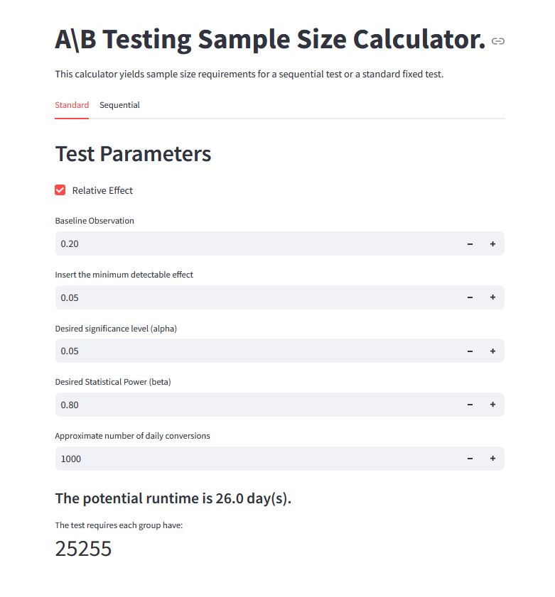
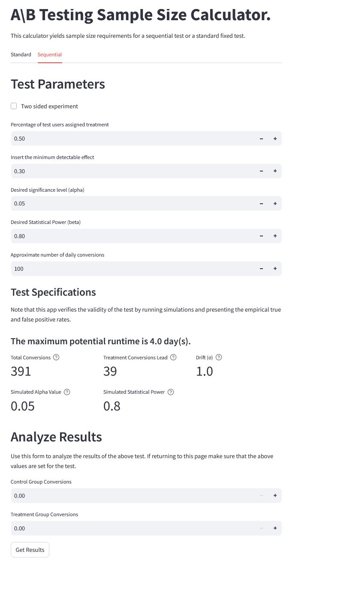

## Brief
When planning A/B tests, uncertainty about the time required and amount of data needed can be frustrating and complicate the planning process. Some stakeholders may turn to external third party calculators to estimate these values to aid in their planning process. The issue with these calculators is they are often not open on their assumptions and can introduce inconsistencies between A/B tests.

This in-house app aims to help stakeholders understand the data requirements and provide time estimates based on company-specific data for their A/B tests while standardizing the setup and methodology across the organization. It offers both standard fixed sample sizes and sequential sample sizes. Additionally, the app provides a straightforward way to evaluate sequential A/B tests, making it accessible to everyone.

Sequential A/B testing is typically better for situations where lower conversion rates occur and would require a significant (in either time or money) cost to run a sufficient fixed test. 

## App Images
For fixed A/B test sample size:

For sequential A/B test sample size:

## Notes

The standard sample size calculator is a python implementation based on [Evan Miller's](https://www.evanmiller.org/) methodology. 

The sequential implementation is a static copy of [freqseq](https://github.com/jgwaugh/freqseq/tree/master), which is also based on Evan Miller's methodology. 

