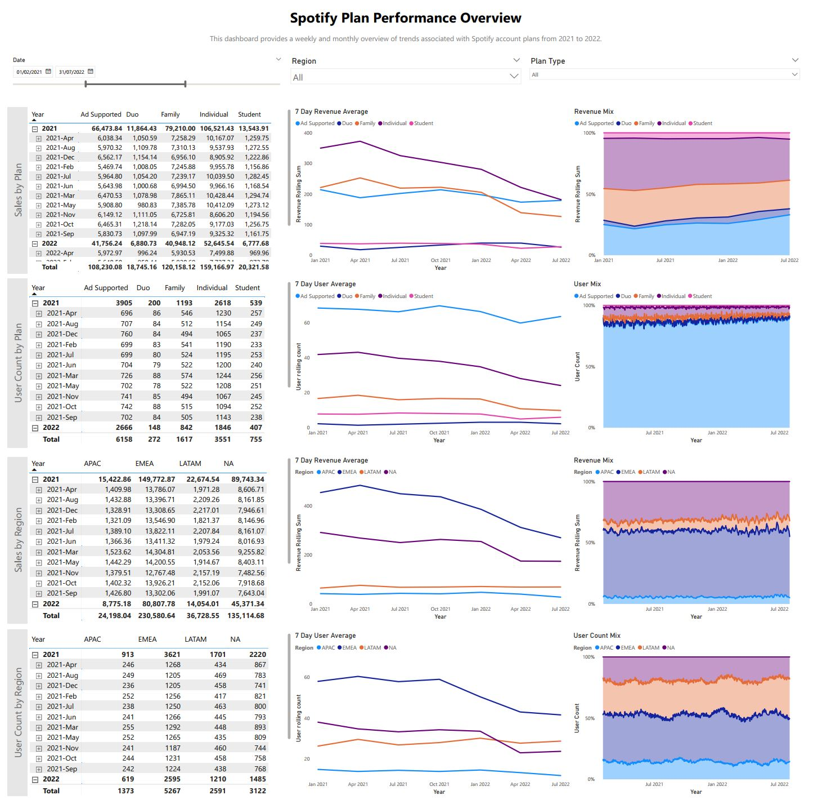

#### Brief
This project is based on a synthetic dataset generated from published Spotify ratios of subscription numbers and userbase demographics.

The purpose of this project would be for a product/marketing teams to identify locations where more targeted campaigns and/or product improvement (such as localization) could be implemented.

# Spotify Plan Performance Overview

## Metrics and Dimensions

**User Count**: Unique count of users
**Revenue**: Gross revenue associated with each plan type (Free, Individual, Duo and Family)
**Plan Type**: Ad-supported (Free), Individual, Duo, Family
**Region**: Latin America (LATAM); Asia Pacific (APAC); North America (NA); Europe, Middle East, Africa (EMEA)

The addition of user count data provides further context for the revenue generated by each plan. The provided dashboard shows two different versions of revenue and user count. 

1. Sliced by Plan Type as requested by the stakeholder 
2. Sliced by Region. Affordability and plan pricing are related to the user's home region. Associating plan performance with regional popularity can provide key insights for marketing and product enhancements.

## Summary of Insights

**Plan Information**
* In July 2021, Individual and Family plan related revenue began to decline—likely due to a loss in revenue in the EMEA region. Is this due to a consolidation of individual accounts into existing family plans? 
* Duo and Student plans are small contributors to revenue. Is there an opportunity here to convert some Ad supported plans to student plans? 
* Individual plans, followed by Family plans, have made the largest contributions to monthly revenue. 

**Region Revenue**
* EMEA is the largest generator of revenue and has the largest concentration of users. There is a drop off of user associated revenue in this region starting in July 2021.
* LATAM contributes a significant portion of users, but generates comparatively low revenue.
* APAC is largely underrepresented relative to the global population. 

## Recommendations & Next Steps
* Investigate the decrease in paying accounts in EMEA and to a lesser extent NA. Ad-supported accounts have remained consistent—so this decline is unlikely to be due to accounts converting from paid to free. Has a competitor released a more compelling product or offered a better deal? Or are they all joining existing Family Plans?
* Is there opportunity for growth in APAC? Approximately 60% of the worlds population is in APAC, yet it is associated with the fewest accounts.
* Are student plans underperforming? Investigate the age demographics of free plan users—could a targeted campaign convert these users into paid subscribers?